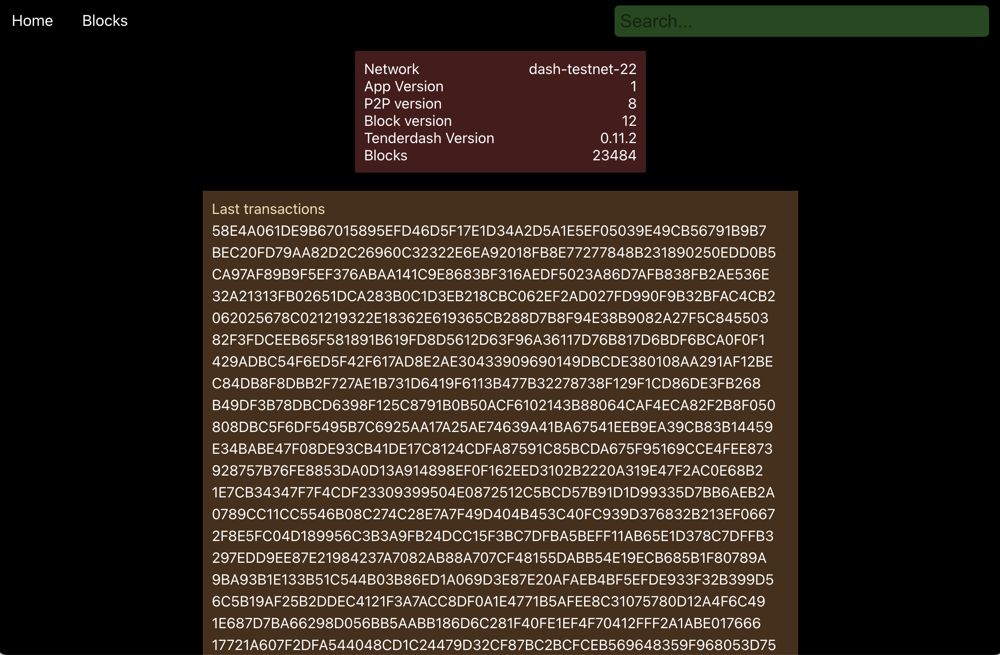

# Dash Platform Explorer



Supports:

* Data Contracts with schemas
* Documents with data
* Searching and listing APIs
* Dash Platform v25+

## Initial setup

Project requires an PostgreSQL and Tenderdash RPC.

To access Tenderdash RPC, you will need an instance running.
You can get it via starting your node with the `dashmate` (testnet or local dev node)

### 1) Start indexer

Edit `packages/indexer/.env` and fill with your PostgreSQL credentials and Tenderdash RPC URL, then do:

```bash
cd packages/indexer
cargo run
```

An indexer should start fetching blocks from the TD and continuously insert the data in the database

### 2) Run backend

Edit `packages/api/.env` and fill with your PostgreSQL credentials, then do:

```
cd packages/api
npm install
npm start
```

### 3) Start frontend

##### If you want to use local backend:

Set `REACT_APP_API_BASE_URL=http://127.0.0.1:3005` in the `packages/frontend/.env`

Then:
```
cd packages/frontend
npm install
npm start
```
